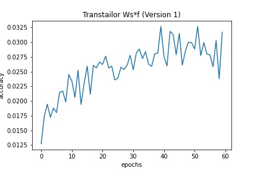
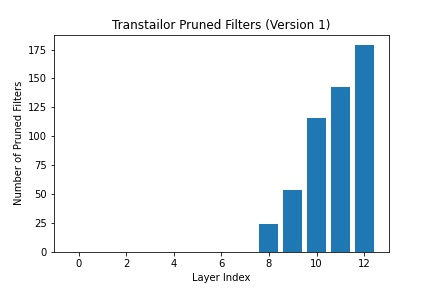
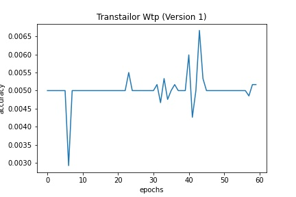
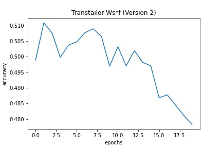
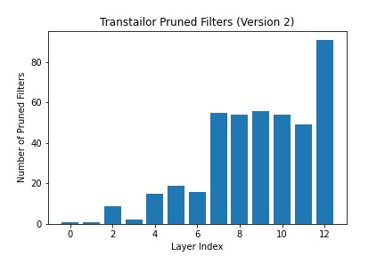
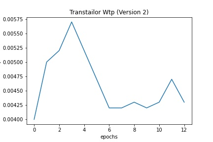

# Reproducción de [Transtailor] (/https://arxiv.org/abs/2103.01542) 

El algoritmo utilizado par aplicar pruning mediante el método Transtailor es el siguiente:
```
1. Inicializar los factores de escalado $alpha$ con valores aleatorios.
2. Fine-tune el modelo para generar W^{s*}_{f}
3. Inicializar el modelo sub-óptimo W^{t}_{o} = W^{s*}_{f}
4. while(1) do
5.   Entrenar los factores de escalado $alpha$ 
6.   Transformar los factores $alpha$ en factores de importancia $beta$ según la ecuación indicada en el paper
7.   Podar el modelo con los factores de importancia $beta$
8.   Fine-tune el modelo podado para generar W^{t}_{p}
9.   if Acc W^{t}_{o} - Acc W^{t}_{p} > $tau$ then
10.     break
11.   else
12.     W^{t}_{o} = W^{t}_{p}
13.  end if
14. end while
15. Obtener el modelo sub-óptimo W^{t}_{o}
```
## Metrícas de evaluación y procedimiento de entrenamiento
En cuanto al método de evaluación, en vez de utilizar el accuracy, se ha utilizado el Balanced Accuracy, con tal de evitar un desbalanceo de clases. 

En cuanto al procedimiento de entrenamiento, se ha utilizado el mismo que se ha utilizado en el paper original, es decir, se ha utilizado el método de fine-tuning, con los mismos learning rates y epochs.

Además se ha utilizado la técnica Early Stopping, con tal de evitar el overfitting y terminar el entrenamiento cuando el modelo ya no mejora.


## Resultados obtenidos
### Versión 1
Para la primera versión, repliqué el algoritmo con exactamente los mismos parámetros que se mencionan en el paper.

Para la primera versión del algoritmo se utilizaron los siguientes datos y parámetros:
- Dataset: CUB-200-2011
- Modelo: VGG 16
- Número de clases: 200
- Número de épochs: 60
- Tamaño del batch: 64
- Optimizador: SGD
- Learning rate en las capas FC: 0.005
- Learning rate en las capas convolucionales: 0.0005

Los resultados obtenidos fueron los siguientes:

#### Generación del modelo $W^{s*}_{f}$



Tal y como se puede observar, el modelo $W^{s*}_{f}$ no ha sido capaz de aprender a partir de los factores $alpha$, al inicializarlos con valores aleatorios.

#### Pruning de los filtros



#### Generación del modelo $W^{t}_{p}$




### Versión 2
En esta versión modifiqué el algoritmo con tal de evitar la perdida que se produce al aleatorizar los factores de escalado $alpha$, para ello los inicialicé con valores a 1.

Para la segunda versión del algoritmo se utilizaron los siguientes datos y parámetros:
- Dataset: CUB-200-2011
- Modelo: VGG 16
- Número de clases: 200
- Número de épochs: 60
- Tamaño del batch: 64
- Optimizador: SGD
- Learning rate en las capas FC: 0.005
- Learning rate en las capas convolucionales: 0.0005

Los resultados obtenidos fueron los siguientes:

#### Generación del modelo $W^{s*}_{f}$



En este caso al inicializar los factores de escalado $alpha$ con valores a 1, el modelo $W^{s*}_{f}$ no ha perdido la información que tenía el modelo original, por lo que ha podido aprender a partir de los factores $alpha$. Sin embargo, el modelo no mejora respecto al modelo original.

#### Pruning de los filtros



El pruning obtenido es muy similar al obtenido en el paper original, los filtros con mayor poda son los de las últimas capas convolucionales.

#### Generación del modelo $W^{t}_{p}$



Tras aplicar la poda sobre el modelo, no es capaz de recuperar la precisión que tenía el modelo original, por lo que no es capaz de mejorar respecto a este.


### Conclusiones

Los resultados de este modelo no son satisfactorios, en la Versión 1 el accuracy obtendio tras la aleatorización de los factores de escalado $alpha$ es de aproximadamente un 3% y en la Versión 2 la perdida de accuracy se produce tras la transformación a los factores de importancia $beta$, con un accuracy inferior a un 1%.
En ambas versiones, el modelo parece converger, sin embargo no recupera la precisión del modelo original.
La poda de los filtros menos importantes (basados en $beta$) es parecida a la mostrada en el paper tal y como se ha mostrado en las imágenes anteriores.

